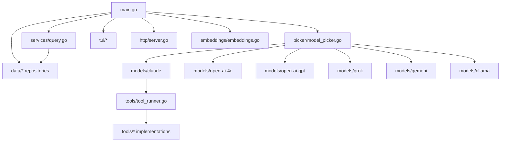
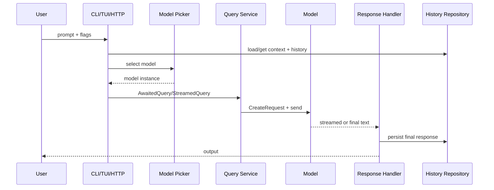
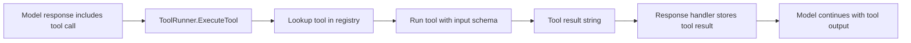

# Owl

Owl is a Go-based AI assistant with three interfaces:

- CLI mode for direct prompts
- TUI mode for interactive terminal conversations
- HTTP server mode for multi-user API access

It supports context-aware chat history, model switching, streaming responses, tool use, and embeddings-based retrieval.

## Quick Start

### Build

```bash
cd src
go mod download
go build -o owl
```

### Run

```bash
# Direct CLI prompt
./owl -prompt "Explain Go interfaces"

# TUI
./owl -tui

# HTTP server
./owl -serve -port 3000
```

## Configuration

### Required API keys

```bash
ANTHROPIC_API_KEY=your_claude_key
OPENAI_API_KEY=your_openai_key
```

### Optional model and storage settings

```bash
GROK_API_KEY=your_grok_key
OLLAMA_HOST=http://localhost:11434
OWL_LOCAL_DATABASE=owl
OWL_LOCAL_EMBEDDINGS_DATABASE=owl_embeddings
```

## Core Usage

```bash
# Context-aware chat
./owl -context_name refactoring -history 5 -prompt "Continue our last discussion"

# Stream output
./owl -stream -prompt "Give me a long answer"

# Attach image from clipboard
./owl -image -prompt "Describe this image"

# Attach PDF
./owl -pdf ./document.pdf -prompt "Summarize this PDF"

# View context history
./owl -view -context_name refactoring -history 20
```

## CLI Flags

Main flags currently wired in `src/main.go`:

- `-prompt` prompt text
- `-context_name` context identifier (default: `misc`)
- `-history` number of previous messages to include
- `-model` model selector
- `-stream` stream response chunks
- `-tui` launch terminal UI
- `-serve` run HTTP server
- `-port` server port (default: `3000`)
- `-secure` HTTPS mode (requires local cert/key files)
- `-view` print saved history for a context
- `-system` set system prompt for a context
- `-thinking`, `-stream_thinking`, `-output_thinking` thinking controls
- `-image` include clipboard image in prompt payload
- `-pdf` include PDF file
- `-web` enable web mode in supported models
- `-embeddings` run embeddings workflow
- `-chunk` chunk markdown and store embeddings
- `-search` search embeddings and query with matches
- `-create_context` generate and create a named context
- `-tools` filter enabled tools by group
- `-skills` load prompt skills from `~/.owl/skills`

## Architecture

### Structure



### Request and response flow



### Tool execution flow



## What Is Implemented

- Multi-mode operation: CLI, TUI, and HTTP server
- Context-based conversation persistence with history replay
- Model selection per request and preferred model persistence per context
- Streaming and non-streaming query execution
- Local data stores for conversation history (single-user and multi-user SQLite flows)
- Embeddings pipeline with markdown chunking and vector search (DuckDB backend wiring)
- Attachment modifiers for image, PDF, and web-enabled prompts
- Tool framework with registration, grouping, and runtime filtering
- System-prompt management per context

## What Owl Can Do

- Hold long-running conversations with named contexts
- Continue a thread with configurable history depth
- Switch model behavior using `-model`
- Stream responses directly to the terminal or HTTP client
- Read and write project files through tool-enabled model workflows
- Generate images with a prompt via the image generation tool
- Create and update notes and todos through integrated tools
- Query semantic matches from embedded markdown documents

## Implemented Models

User-selectable models wired through `picker.GetModelForQuery`:

- `claude`
- `opus`
- `sonnet`
- `haiku`
- `4o`
- `gpt`
- `codex`
- `grok`
- `gemeni`
- `ollama`
- `qwen3`

Additional model packages in repository:

- OpenAI embeddings model (`models/open-ai-embedings`)
- OpenAI responses/image model (`models/open-ai-responses`)
- OpenAI vision model (`models/open-ai-vision`)
- Vertex Claude model package (`models/vertex-claude`)

## Implemented Data Models

Core persisted and transport model types:

- `data.Context`
- `data.History`
- `data.User`
- `data.EmbeddingMatch`
- `commontypes.ToolResponse`
- `commontypes.TokenUsage`
- `tools.Tool`

## Implemented Tools

Registered tools (active):

- `git_info`
- `list_files`
- `read_file`
- `write_file`
- `update_file`
- `note`
- `create_todo`
- `image_generator`

## HTTP API

Current server routes in `src/http/server.go`:

- `POST /api/login`
- `POST /api/prompt`
- `GET /api/context`
- `GET /api/context/{id}`
- `POST /api/context/{id}/systemprompt`
- `POST /api/context/{id}/setmodel`
- `GET /status`

## Known Limitations

- `http_request` tool is intentionally omitted because it is not working in current runtime configuration.
- HTTPS server mode requires local `cert.pem` and `key.pem` files.
- Some provider integrations depend on external credentials and environment setup.
- Test coverage is currently focused on selected packages (for example chunking) rather than every package.

## Roadmap Ideas

- Expand automated tests across HTTP, tools, and model packages
- Improve docs for deployment and production-grade server setup
- Add clearer migration and backup flows for local databases
